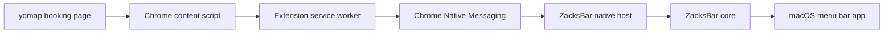

# ZacksBar Architecture

ZacksBar is built as a native macOS menu bar app with a small Chrome companion extension. The browser stays responsible for reading ydmap pages that already run in the user's logged-in Chrome session. The macOS app stays responsible for local state, notifications, rule matching, setup health, and future native UI.



## Components

`extensions/chrome`
: Chrome MV3 extension. It injects a content script on supported ydmap booking pages, detects captcha text, reads ydmap Vue schedule state from `rows`, `platformInColumns`, and `isAvailableStatic(cell)`, normalizes court availability snapshots, dedupes unchanged snapshots, and forwards protocol messages to the native host.

`apps/macos/Sources/ZacksBarNativeHost`
: Command-line native host entrypoint used by Chrome Native Messaging. It reads length-prefixed JSON messages from stdin and writes length-prefixed JSON responses to stdout.

`apps/macos/Sources/ZacksBarCore`
: Shared Swift package code for message framing, app support storage paths, latest state persistence, menu state summarization, watch-rule matching, privacy redaction, and native host manifest generation.

`apps/macos/Sources/ZacksBarApp`
: Swift menu bar app skeleton. It owns the status item, menu model, latest-state refresh action, setup/diagnostic entry points, and future native settings UI.

`packages/protocol`
: JSON schemas and fixtures for messages exchanged between Chrome and the native side.

## Message Flow

1. The content script inspects supported booking pages on a polling interval.
2. Captcha-like page text emits `captcha.detected`.
3. Ready ydmap Vue schedule state emits deduped `availability.updated`.
4. The service worker adds tab context and forwards the message through `chrome.runtime.connectNative`.
5. The native host decodes the Chrome Native Messaging frame, appends `native-events.jsonl`, and updates `latest-state.json`.
6. The menu bar app reads `latest-state.json` at launch and on Refresh to update status.

## Local State

The native host writes local app state under:

```text
~/Library/Application Support/ZacksBar/
```

Important files:

- `native-events.jsonl`: append-only event log for diagnostics.
- `latest-state.json`: compact latest availability/captcha/health snapshot for the menu app.

These files are local runtime data and must not be committed.

## Protocol Rules

- Every message uses `schemaVersion`, `messageId`, `type`, `sentAt`, `source`, and `payload`.
- Browser messages must avoid credentials, cookies, and raw query strings.
- URLs are redacted before leaving the content script and redacted again on the native side as defense in depth.
- Schema fixtures are tested with `npm test`.

## Upgrade Model

ZacksBar should support two upgrade tracks:

- App upgrade: future signed macOS releases can update the native app, native host, docs, and bundled extension assets.
- Extension/script upgrade: the production path is the Chrome companion extension. Tampermonkey scripts are treated as migration references, not as the long-term runtime. Future import helpers may read an existing userscript only after explicit user approval.

The native host manifest is installed locally because Chrome requires it. It points Chrome to the native host executable and whitelists the local extension ID.
